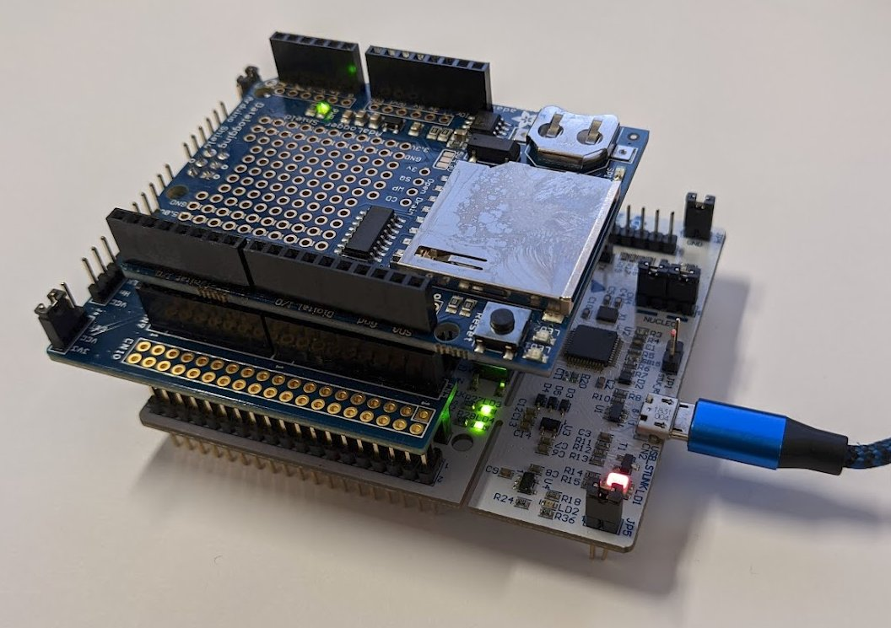
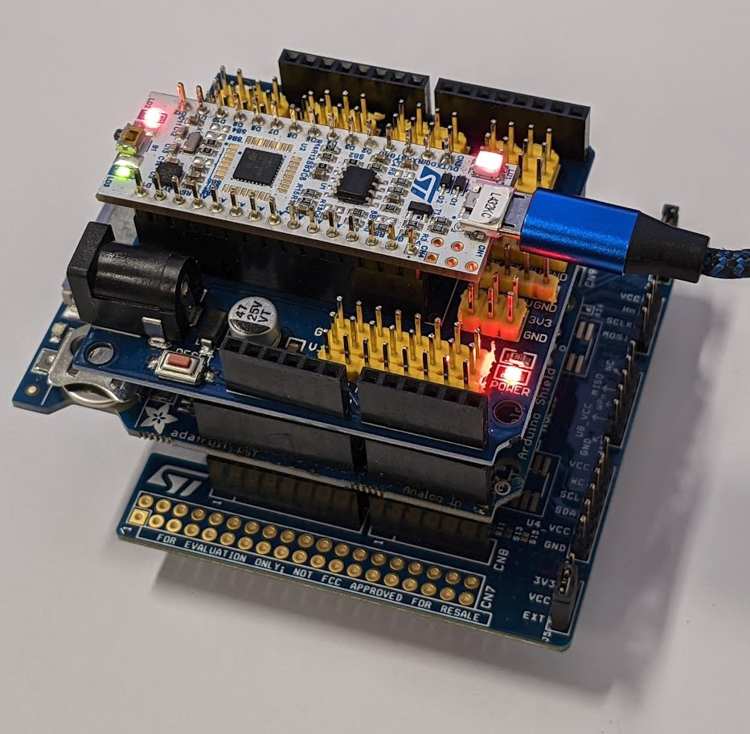
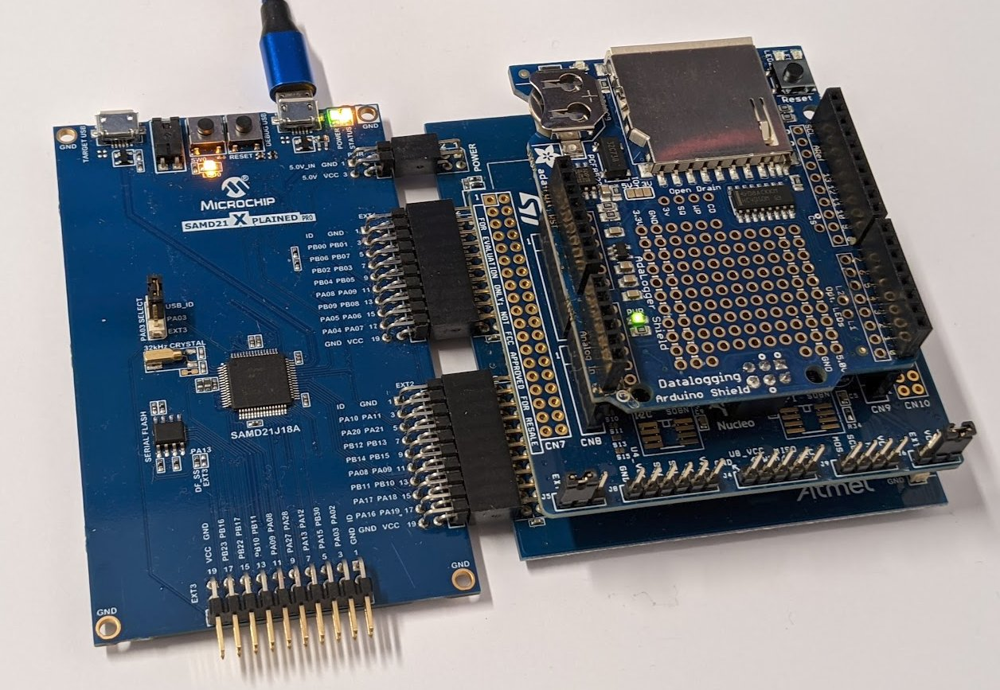
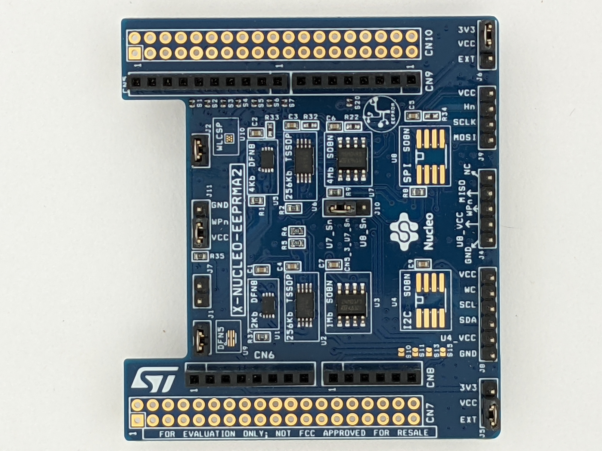
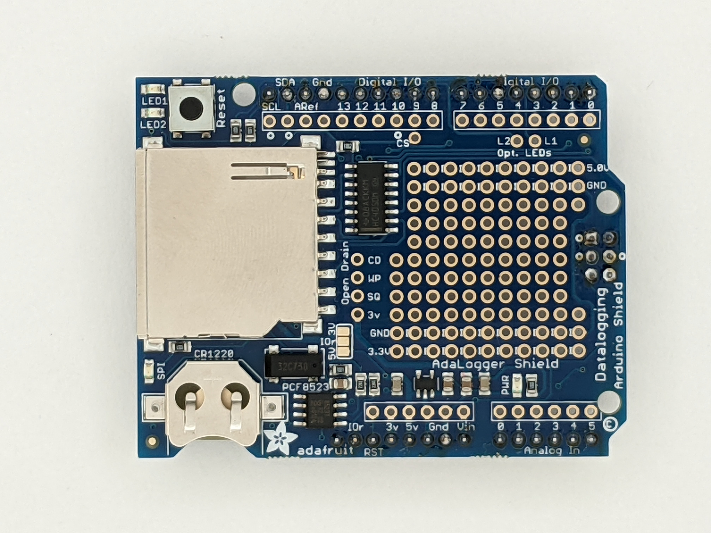
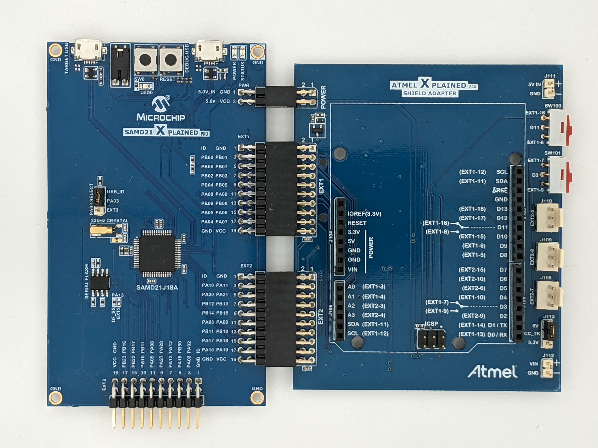

# What is NK Labs?

See: [https://www.nklabs.com/](https://www.nklabs.com/)

# NK Labs common library

This is our library for very quickly making products based on common 32-bit
and 64-bit microcontrollers.  It is a layer added on top of the MCU vendor's
library that provides features required for almost every product.  It
provides these features:

### User interface

In this case, a UART-based command line interface (CLI) with history,
editing and tab-completion.  Commands are defined near the code they intend
to use- there is no need to edit a central command table or call any
registration functions.  This makes it easy to casually add commands for
debugging or bring-up.

The CLI is powerful enough to be customer facing.  There is on-line help and
commands can be marked to be disabled and hidden unless your product is in
some kind of "factory service mode".

Even if you do not need or want a customer facing CLI, having a CLI almost
always saves time.  It provides a way for team members to use the product
before it is finished.  For example, a test engineer might have to focus on
a specific peripheral for qualification.  Commands can be easily provided to
allow him or her to be independent, and not require a firmware engineer to
be present for every action.

### Firmware updates

Almost every product needs some kind of remote firmware update capability. 
This library provides one way to do it which can be extended to match your
needs:

First, you can download a firmware update file into local flash memory using
the YMODEM protocol over the CLI.  YMODEM is an old standard protocol for
transferring files over a serial port that is built into most terminal /
modem programs, such as TeraTerm and PuTTY.  This is nice, since no
host-side software has to be developed.

Second, after reboot, a bootloader copies the firmware from the local flash
memory (after doing a final integrity check) to the main MCU flash memory to
complete the update.

This local flash memory could be unused space in the MCU flash memory, or it
could be an external device such as a SPI-flash chip.

### Embedded database

Many products need some kind of non-volatile storage for calibration and
configuration settings- something akin to the Windows Registry.  We provide
a schema-defined database with schema-change / migration support for this. 
The idea is to save a serialized version of a C-structure into non-volatile
memory such as SPI-flash.  On boot up, the database is deserialized back
into RAM.  Fields can be added or deleted as the product evolves.  New
fields will be loaded with a default value, and data for deleted fields will
be ignored.

The C-structure can be arbitrarily complex (including arrays, strings and
substructures), but must not use pointers and must fit in a contiguous
region of memory.  Malloc is not used at all.  Arrays and strings are
variable in size, but bounded to a pre-allocated maximum size.

The serialized format of a database can also be transferred over the CLI. 
This allows you to save the database on a host computer.

The CLI provides an automatic interface to set or get individual fields from
the database.  You can index a part of the database using an expression,
somewhat similar to XML's XPath expressions.

See the [Example application commands](doc/app.md) document to see how these
work.

### Common drivers and foundations

Some basic drivers for common devices are included:

* Flash memory
* SPI and I2C EEPROM
* Real Time Clock

But an ever growing set of drivers for other common ICs is also included. 

See the [drivers list](doc/drivers.md)

Some foundational libraries are also provided:

* A low memory footprint version of printf that supports floating point (it is smaller than newlib's printf).
* A unified parsing system: it's used for parsing command line arguments and deserializing databases.
* An instream / outstream library that redirects input and output from the above formatting and parsing functions to block devices or strings.
* A work-queue scheduler, replaces an RTOS in cases where you don't need preemption and your code is event driven.

### Other characteristics

* Malloc is not used at all to ensure determinism
* The example application includes watchdog timer support
* The build system includes automatic insertion of git hash, build date and version numbers into the binary.
* Commonly used cryptographic and CRC functions are also included
* The example application just fits on an STM32F030R8 (64K Flash, 8K RAM).  We recommend at least 96K of flash and 20K of RAM.

# Integrating libnklabs with your own project

The library is designed to be modular, though many of the modules depend on
each other.

Each module includes C source and header files.  But many also include a
configuration header file (.h) for customization options.  The idea is that
configuration header files should be tailored for the specific project, but
the source files should not be modified.

The configuration and header files are located in their own directories. 
These must be added to the include file search path, for example:

	gcc -I../config -I../inc -c nkscan.c

It is recommended to use -Os and link-time optimizations: these save space
by eliminating unused code.

### Unit tests

To execute the unit tests:

	cd tests
	make

# Example Application

The source code for an example application is available in [app/](app/).

It can be compiled for various targets, see [target/](target/).

To build a particular example and install it on a target board:

	cd target/nucleo-g071rb
	make
	make flash

It is important to work with and not replace the vendor tools and libraries
in commercial products.  The example uses each vendor's tool generated HAL
(hardware abtraction layer) and Makefile.  In particular:

* STM32CubeMX allows you to instantiate peripherals, define the pinouts, set up clocking and generate startup code for ST Mirco's MCUs.

* Atmel Start is a web tool that does the same for Microchip/Atmel's ATSAM ARM microcontrollers.

These tools do have a learning curve that we believe is worth overcoming. 
The example application provided here can be a good starting point for this.

It is important to note that these tools are not IDEs.  They can target
IDEs, but they also can generate code that can be built from the command
line using Make and Gcc.  We prefer this since it facilitates automated
testing and building.

Once the application is running, the follow commands are available:

[Example application commands](doc/app.md)

## Arduino interface

The example application includes CLI commands that allow you to access
common embedded system peripherals including I2C EEPROMs, SPI-Flash devices
and an external Real Time Clock.  The low cost vendor development boards do
not include these peripherals, so the example application accesses them on
the following Arduino "shield" boards that can be plugged into the MCU
vendor's development boards:

The example application will work without these shields, you just lose the
associated features.

Shields plugged into ST Nucleo board:

ST Nucleo Nano board plugged into Nano adapter, then plugged into shields:

Shields plugged into ATARDADPT-XPRO for Atmel Xplained Pro board:

For I2C and SPI EEPROMs:

[X-NUCLEO-EEPRMA2](https://www.st.com/en/evaluation-tools/x-nucleo-eeprma2.html)

For the PCF8523 Real Time Clock:

[Adalogger Shield](https://learn.adafruit.com/adafruit-data-logger-shield)

You need a recent version of this board- one that supports 3.3v.

For Atmel/Microchip's Xplained Pro development boards, you need this Arduino
Shield adapter to use the above boards:

[ATARDADPT-XPRO](https://www.microchip.com/en-us/development-tool/ATARDADPT-XPRO)

# Module Documentation

[nkarch - processor specific functions](doc/nkarch.md)

[nkchecked - maintain a CRC-protected file in flash memory](doc/nkchecked.md)

[nkcli - command line interface](doc/nkcli.md)

[nkdatetime - Date / Time functions](doc/nkdatetime.md)

[nkdbase - schema driven database](doc/nkdbase.md)

[nkdirect - treat a region of flash memory as a file](doc/nkdirect.md)

[nki2ceeprom - I2C EEPROM driver](doc/nki2ceeprom.md)

[nki2c - I2C device driver](doc/nki2c.md)

[nkinfile - input abstraction](doc/nkinfile.md)

[nkoutfile - output abstraction](doc/nkoutfile.md)

[nkprintf - formatted output](doc/nkprintf.md)

[nkreadline - command line editor](doc/nkreadline.md)

[nkrtc - Real Time Clock functions](doc/nkrtc.md)

[nkscan - formatted input](doc/nkscan.md)

[nksched - minimal work queue scheduler](doc/nksched.md)

[nkserialize - schema driven serialization](doc/nkserialize.md)

[nkspiflash - SPI Flash / EEPROM driver](doc/nkspiflash.md)

[nkspi - SPI device driver](doc/nkspi.md)

[nkymodem - YMODEM protocol](doc/nkymodem.md)

# Licensing

The MIT License file is called "nklib_mit_license.txt".  Add the contents to
the top of all new source and header files.
